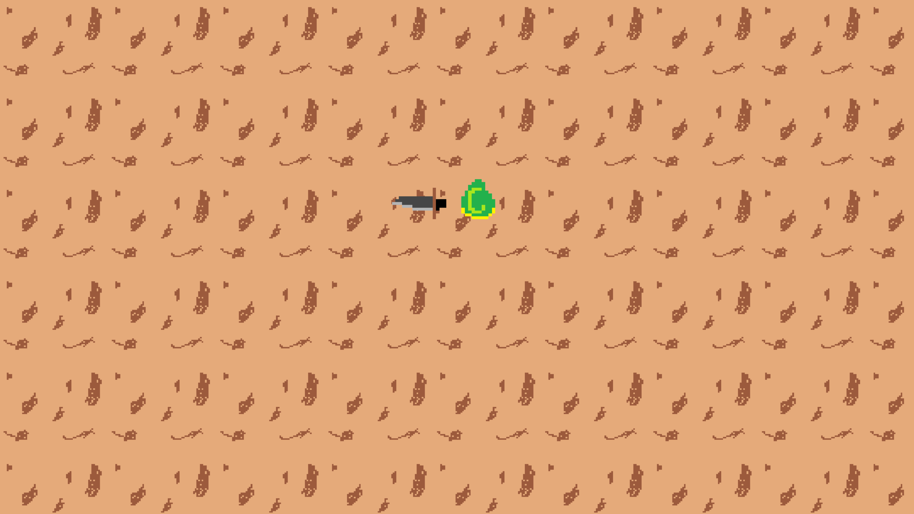

# Zelda-like Game



A top-down 2D adventure game inspired by The Legend of Zelda, developed using Python and Pygame. This project is a personal endeavor to practice programming with the help of both GitHub Copilot and GPT-4 AI language models.

## Table of Contents

- [Introduction](#introduction)
- [Features](#features)
- [Requirements](#requirements)
- [Installation](#installation)
- [How to Play](#how-to-play)
- [Credits](#credits)

## Introduction

I've always been a huge fan of The Legend of Zelda series, and I wanted to create a Zelda-like game to improve my programming skills and explore the capabilities of AI language models like GPT-4 and GitHub Copilot in my development process. This game is a result of that journey, and I'm excited to share it with the world.

## Features

- Top-down 2D gameplay inspired by The Legend of Zelda
- Player character with smooth movement and rotation
- Swinging sword mechanic for combat
- Tiled background with support for custom images
- Procedurally generated background music
- Fullscreen mode with configurable rendering resolution

## Requirements

- [Python](https://www.python.org/) 3.11.2 or higher
- [Pygame](https://github.com/pygame/pygame) 2.3.0 or higher
- [NumPy](https://github.com/numpy/numpy) 1.24.2 or higher

## Installation

1. Clone the repository:
```
git clone https://github.com/AlexKautz/OrbQuest
```

2. Navigate to the project folder:
```
cd zelda-like-game
```

3. Install the required dependencies:
```
pip install -r requirements.txt
```

4. Run the game:
```
python main.py
```


## How to Play

- Use the arrow keys to move the player character.
- Press the spacebar to swing the sword.
- Explore the world, and enjoy the procedurally generated background music.

## Credits

- Game developed by [Alex Kautz](https://github.com/AlexKautz)
- Thanks to the [Python](https://www.python.org/) team
- Thanks to the [Pygame](https://www.pygame.org/) team
- Thanks to the [NumPy](https://numpy.org/) team
- Special thanks to OpenAI's GPT-4 and GitHub Copilot for assisting in the development process

Feel free to explore the project, provide feedback, or contribute! Enjoy the game, and happy adventuring!


